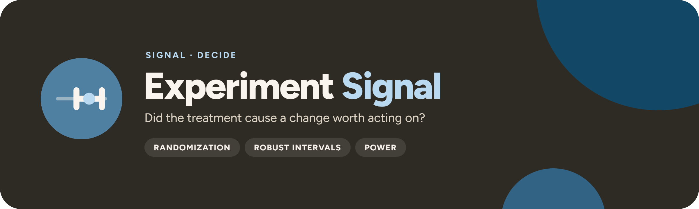

<p align="center">
  
</p>

<p align="center">
  <a href="https://github.com/UlrikErlingsen/experiment-analysis/actions"></a>
  <a href="https://github.com/UlrikErlingsen/signal-hub"></a>
  
  
  <a href="LICENSE"></a>
</p>

<p align="center"><strong>Open experiment decision support — declare the contrast, audit the design, estimate the effect, preserve the uncertainty.</strong></p>

**Experiment Signal** helps analysts, marketers, and product teams decide whether a randomized between-subject treatment caused a change large enough to matter. It combines a written design contract, assignment and missingness audit, robust adjusted cell means, pairwise contrast families, factorial decomposition, practical decision bounds, prospective power planning, and a reproducible evidence pack.

> Did the treatment cause a change worth acting on?

Everything runs locally with open-source Python packages. There is no account, telemetry, external AI call, remote database, or built-in persistence.

## Read this first

> **The app estimates contrasts; it does not manufacture randomization.** A causal interpretation requires a valid assignment process, one observation per randomized unit, treatment before outcome, acceptable outcome observation, limited interference, faithful implementation, and an analysis matched to the design.

Experiment Signal never uses `p < .05` as a rollout rule. The declared treatment-minus-control estimate and confidence interval are compared with a minimum worthwhile effect in outcome units. P-values remain visible as supporting diagnostics and are explicitly labeled exploratory.

## Scope

**Version 1.2 supports:**

- individually randomized, between-subject experiments;
- one to three treatment factors, with two to eight levels per factor;
- a continuous numeric or declared two-level binary primary outcome;
- a declared cell-to-cell primary contrast;
- optional numeric **pre-treatment** covariates;
- covariate-adjusted cell means or binary risks with cell-specific slopes and HC3 covariance;
- binary risk differences in percentage points as the primary effect — Newcombe hybrid Wilson score intervals without covariates, HC3 linear-probability intervals with covariates — plus descriptive unadjusted risk and odds ratios;
- contract templates for a communication test, a price test, and a feature rollout;
- all pairwise cell contrasts with Holm-adjusted exploratory p-values;
- robust Type-II factorial term tests and descriptive partial eta-squared;
- Welch's unequal-variance omnibus diagnostic;
- fixed-seed sharp-null permutation inference for unadjusted two-arm, one-factor experiments;
- prospective two-arm independent-means or independent-proportions sample-size planning.

**It does not** claim support for clustered assignment, repeated measures, paired or crossover studies, count/ordered/survival outcomes, noncompliance estimands, adaptive or sequential designs, blocking-specific randomization inference, interference, missing-outcome correction, heterogeneous-effect discovery, or observational causal identification. Binary analysis uses a robust linear-probability estimand; designs needing conditional odds ratios, rare-event methods, or clustered binary inference require design-matched analysis. Price ladders, willingness to pay, and elasticity belong to **[Tag Signal](https://github.com/UlrikErlingsen/pricing-analysis)**; offline recommendation-policy comparison belongs to **[Recommend Signal](https://github.com/UlrikErlingsen/recommender-evaluation)**, whose selected policy still needs an online randomized test here.

## Try the demo in three minutes

1. Start the app: the fictional 2×2 demo is preloaded, so there is nothing to upload. Click **Load fictional binary message demo** for a two-arm test with a binary recall outcome, or **Load fictional 2×2 demo** to restore the default; uploading your own table replaces the demo.
2. Review the saved design contract: two randomized factors, one continuous primary outcome, one baseline covariate, and a 0.40-point minimum worthwhile effect.
3. Open the audit. Compare assigned counts, outcome observation rates, and baseline standardized differences across the four cells.
4. Run the declared analysis. Read the primary adjusted contrast and its HC3 confidence interval before opening the test-statistic details.
5. Review the factorial interaction and the full pairwise family without changing the primary contrast.
6. Open the decision page and export the privacy-minimized evidence record as Excel, CSV-ZIP, or JSON.

The example is deterministic synthetic data for a fictional service. It represents no real person, organization, course case, or empirical result.

## Data contract

Use one row per randomized unit. CSV files up to 1000 MB and 5,000,000 rows are supported locally (500 columns at most); Excel workbooks up to 50 MB and JSON up to 250 MB, because those formats are slower and heavier to parse — save larger tables as CSV. Estimation and the audit use every row; only the optional sharp-null permutation test runs on a seeded random subsample of 100,000 complete rows when there are more, and says so in the app and the evidence pack.

| unit_id | treatment | primary_outcome | baseline_measure |
|---|---|---:|---:|
| U001 | Control | 4.2 | 3.9 |
| U002 | Treatment | 5.1 | 4.1 |

For a factorial design, use one column per randomized factor. Treatment labels should describe assignment, not observed exposure after noncompliance. Keep rows with missing outcomes so the audit can compare outcome-observation rates by assigned cell. The fictional demos and a starter template are in [`examples/`](examples/); the app also offers the starter template as a download. See the [data guide](docs/data-guide.md).

## Analysis contract

The app requires a named:

- randomized unit identifier;
- primary continuous outcome or binary outcome with its declared success value;
- one to three treatment factors;
- control and treatment cells for the primary contrast;
- minimum worthwhile effect in outcome units (percentage points for a binary outcome);
- target population, assignment mechanism, analysis population, stopping rule, and guardrail;
- optional pre-treatment covariates.

The contract also records four design confirmations: known random assignment, a pre-specified outcome and contrast, treatment before outcome measurement, and an outcome-independent stopping rule. The contract page refuses to save a zero minimum worthwhile effect. The communication-test, price-test, and feature-rollout templates prefill claim wording and outcome type only; they never invent data, columns, or thresholds.

## Methods

1. **Audit:** assigned-cell counts, unique-ID problems, outcome observation rates by assigned cell, pairwise standardized mean differences for declared baseline measures, and complete-case retention. SMDs are magnitude diagnostics, not tests that randomization succeeded.
2. **Model:** covariates are centered at their complete-sample means. The adjusted model interacts each treatment cell with each declared covariate, then standardizes cell predictions to those centered values. This follows the logic of agnostic regression adjustment for randomized experiments while keeping the specific cell contrast primary.
3. **Uncertainty:** HC3 intervals are primary. An unadjusted binary primary contrast uses the Newcombe hybrid Wilson score interval; a covariate-adjusted binary contrast uses an HC3 linear probability model and flags adjusted probabilities outside 0–1.
4. **Families and factorial terms:** all cell pairs form one comparison family with Holm-adjusted exploratory p-values; factorial main effects and interactions use a robust Type-II decomposition. The declared cell contrast stays primary.
5. **Randomization inference:** for unadjusted two-arm, one-factor data, a fixed-seed permutation test targets Fisher's sharp null; it is withheld for other designs.
6. **Decision:** the interval is compared with the declared minimum worthwhile effect (see below). No status is triggered by p < .05.

See [methods](docs/methods.md).

## Decision statuses

- **MEANINGFUL LIFT**: the full interval is above the positive minimum worthwhile effect.
- **POTENTIAL HARM**: the full interval is below the negative boundary.
- **BOUNDED SMALL**: the full interval lies inside the symmetric not-worth-acting band.
- **UNCERTAIN**: the interval crosses a practical boundary.
- **DIRECTIONAL ONLY**: no positive minimum worthwhile effect was declared, so the reading is only a zero-null significance statement, never presented as a decision. The contract page refuses to save a zero threshold.
- **ASSOCIATION ONLY**: random assignment is not confirmed.
- **DESIGN AT RISK**: a severe uniqueness, cell-size, or outcome-observation audit flag is present.

These are transparent evidence readings, not automatic launch approvals. Costs, guardrails, external validity, treatment fidelity, novelty effects, ethics, and operational feasibility remain outside the estimator. See the [decision guide](docs/decision-guide.md).

## Exports

Excel, CSV-ZIP, and JSON exports include:

- source filename, sheet, and SHA-256 fingerprint;
- the design contract and causal-status statement;
- software version and exact analysis settings;
- cell counts, outcome observation, and baseline-balance tables;
- adjusted cell means, primary and pairwise contrasts, factorial term tests, and diagnostics;
- the interval-based decision rule and warnings.

Unit-level identifiers, outcomes, covariates, fitted values, and residuals are excluded. Exported text is neutralized against spreadsheet-formula interpretation.

## Run locally

You need Python 3.10 or newer and a local copy of this folder.

**macOS:** double-click `run_app.command`. **Windows:** double-click `run_app.bat`.

The first launch creates a private `.venv` and downloads open-source dependencies. Later launches reuse it. Or use a terminal:

```bash
python3 -m venv .venv
source .venv/bin/activate  # Windows: .venv\Scripts\activate
python -m pip install -r requirements.txt
python -m streamlit run app.py
```

Experiment Signal prefers local port `8592` and falls back to another free port on macOS. Both launchers honor `EXPERIMENTSIGNAL_PORT` and `EXPERIMENTSIGNAL_MAX_UPLOAD_MB` (the Streamlit upload limit in MB, default 1000); the macOS launcher also honors `EXPERIMENTSIGNAL_NO_BROWSER`. Setting `EXPERIMENTSIGNAL_DEBUG=1` in the app's environment reveals technical error details on either platform. The app itself never accepts more than 1000 MB, so `EXPERIMENTSIGNAL_MAX_UPLOAD_MB` can lower the limit (for example on a small shared machine) but not raise it.

### Docker

```bash
docker build -t experimentsignal .
docker run --rm -p 8592:8592 experimentsignal
```

Then open `http://127.0.0.1:8592`. The container runs as a non-root user and includes a health check. The image sets `STREAMLIT_SERVER_MAX_UPLOAD_SIZE=1000`; pass `-e STREAMLIT_SERVER_MAX_UPLOAD_SIZE=200` (or any smaller value) to `docker run` to lower the upload limit for a hosted copy.

## Privacy

Data entered in the browser is processed by the local Streamlit process and remains there unless you download or otherwise move it; remove identifiers and fields not needed for the declared analysis before upload. If someone hosts Experiment Signal, that operator becomes responsible for transport security, authentication, logs, retention, and applicable privacy obligations. See [PRIVACY.md](PRIVACY.md).

## No install? Give this file to an AI

[AI_ANALYST.md](AI_ANALYST.md) is a standalone analysis protocol for a capable AI assistant. It contains the same scope limits, calculations, honesty rules, and output structure. A local app is the more private option: a cloud AI sees whatever you upload or paste.

## Development

```bash
python -m pip install -e ".[test]"
python -m pytest
python -m ruff check .
python -m build
```

The analysis core (`experimentsignal`) installs without Streamlit or Plotly; the app needs the `ui` extra (`python -m pip install -e ".[ui]"`), and `requirements.txt` lists everything for the launchers and Docker. [Signal Hub](https://github.com/UlrikErlingsen/signal-hub) embeds the app through `experimentsignal.ui.render()`.

The suite checks known two-arm calculations, synthetic factorial recovery, HC3 interval structure, Holm multiplicity, deterministic randomization inference, SMD auditing, missing outcomes, decision boundaries, power calculations, safe imports/exports, example generation, the shared Signal shell, every Streamlit page, and the Signal Hub contract (no Streamlit or Plotly import outside `ui/`, `render()` without a page config, namespaced keys, no repo-root files at runtime).

## Where this fits in Signal

Experiment Signal is where a causal question gets tested: Driver Signal flags measured experiences that deserve a causal test, and a policy chosen offline in Recommend Signal still needs an online randomized test here. It shares the suite's local-first, named-method, fictional-demo, portable-evidence, and explicit-boundary standard.

- **Worth Signal** asks what customers and relationships are worth.
- **Segment Signal** asks whether customers form stable, useful groups.
- **Choice Signal** asks how product attributes drive choice.
- **Adopt Signal** asks when a new product gets adopted.
- **Position Signal** asks where brands sit relative to competitors.
- **Alloc Signal** asks where the next marketing budget should go.
- **Driver Signal** asks which measured experiences move with satisfaction and deserve a causal test.
- **Gate Signal** asks whether a concept should receive the next bounded investment.
- **Measure Signal** asks whether a multi-item score measures what you think it does.
- **Text Signal** asks what recurring language patterns appear in open-ended responses.
- **Tag Signal** asks what price range is supported and how unit contribution changes, from assigned-price, historical, or willingness-to-pay evidence.
- **Recommend Signal** compares recommendation policies offline; its selected policy still needs an online randomized test here before anyone claims commercial or causal lift.
- **Trace Signal** asks how logged customer journeys actually unfold: transitions, path support, drop-off, and Markov removal sensitivity, with no causal channel credit.
- **Track Signal** asks whether brand measures moved across tracking waves by more than a declared practical threshold.
- **Experiment Signal** asks whether an assigned treatment caused a practically meaningful change.

<!-- signal-suite:start (generated from signal-hub/apps.yaml by scripts/sync_readme_suite.py) -->
| Family | App | Asks |
|---|---|---|
| Brand | [Track Signal](https://github.com/UlrikErlingsen/brand-tracking) | Is the brand moving, or is the tracker just noisy? |
| Brand | [Position Signal](https://github.com/UlrikErlingsen/brand-positioning) | Where do brands sit relative to competitors? |
| Market | [Prospect Signal](https://github.com/UlrikErlingsen/b2b-prospecting) | Which Norwegian companies fit your ideal customer, and which first? |
| Market | [Listen Signal](https://github.com/UlrikErlingsen/media-listening) | Who is talking about the brand in Norwegian media, and in what tone? |
| Market | [Influence Signal](https://github.com/UlrikErlingsen/influencer-campaigns) | Which creators delivered, and was every post labelled properly? |
| Market | [Season Signal](https://github.com/UlrikErlingsen/marketing-calendar) | What does the Norwegian marketing year look like, worked backwards? |
| Market | [Adopt Signal](https://github.com/UlrikErlingsen/adoption-forecasting) | When will a new product be adopted? |
| Market | [Rival Signal](https://github.com/UlrikErlingsen/competitor-analysis) | Which rivals matter, and how could they respond? |
| Market | [Reach Signal](https://github.com/UlrikErlingsen/location-catchment-analysis) | Where could a new location reach, and how would it share demand with existing sites? |
| Customer | [Worth Signal](https://github.com/UlrikErlingsen/customer-value-analytics) | What are customers and relationships worth? |
| Customer | [Segment Signal](https://github.com/UlrikErlingsen/customer-segmentation) | Do customers form stable, useful groups? |
| Customer | [Trace Signal](https://github.com/UlrikErlingsen/journey-path-analysis) | How do logged customer journeys actually unfold? |
| Customer | [Blueprint Signal](https://github.com/UlrikErlingsen/service-blueprinting) | How is the customer experience actually delivered, and where do the handoffs fail? |
| Customer | [Recommend Signal](https://github.com/UlrikErlingsen/recommender-evaluation) | Which recommendation policy should be tested live? |
| Research | [Choice Signal](https://github.com/UlrikErlingsen/conjoint-analysis) | How do product attributes drive choice? |
| Research | [Driver Signal](https://github.com/UlrikErlingsen/survey-driver-analysis) | Which measured experiences move with satisfaction? |
| Research | [Measure Signal](https://github.com/UlrikErlingsen/measurement-validation) | Does a multi-item score have a defensible structure? |
| Research | [Text Signal](https://github.com/UlrikErlingsen/open-text-analysis) | What recurring patterns appear in open-ended responses? |
| Research | [Tag Signal](https://github.com/UlrikErlingsen/pricing-analysis) | What price range is supported, and how does profit move? |
| Research | [Learn Signal](https://github.com/UlrikErlingsen/research-prioritization) | Which uncertainty is worth paying to research before you decide? |
| Decide | **Experiment Signal** (this app) | Did the treatment cause a practically meaningful change? |
| Decide | [Gate Signal](https://github.com/UlrikErlingsen/launch-decision-gate) | Does a concept deserve the next investment? |
| Decide | [Shift Signal](https://github.com/UlrikErlingsen/cannibalization-analysis) | Does a launch grow the portfolio, or move existing demand around? |
| Decide | [Alloc Signal](https://github.com/UlrikErlingsen/marketing-mix-allocation) | Where should the next marketing budget go? |

All 24 apps run side by side in [Signal Hub](https://github.com/UlrikErlingsen/signal-hub), each opening with fictional demo data. Every repo carries the [`signal-suite`](https://github.com/topics/signal-suite) topic, and the suite is listed at [ulrikerlingsen.com](https://ulrikerlingsen.com). Freddo CRM is a separate product.
<!-- signal-suite:end -->

## References

- Neyman, J. (1923/1990). On the Application of Probability Theory to Agricultural Experiments. *Statistical Science, 5*(4), 465–472. https://doi.org/10.1214/ss/1177012031
- Rubin, D. B. (1974). Estimating causal effects of treatments in randomized and nonrandomized studies. *Journal of Educational Psychology, 66*, 688–701. https://doi.org/10.1037/h0037350
- Welch, B. L. (1951). On the Comparison of Several Mean Values: An Alternative Approach. *Biometrika, 38*, 330–336. https://doi.org/10.1093/biomet/38.3-4.330
- MacKinnon, J. G., & White, H. (1985). Some heteroskedasticity-consistent covariance matrix estimators with improved finite sample properties. *Journal of Econometrics, 29*, 305–325. https://doi.org/10.1016/0304-4076(85)90158-7
- Long, J. S., & Ervin, L. H. (2000). Using heteroscedasticity consistent standard errors in the linear regression model. *The American Statistician, 54*(3), 217–224. https://doi.org/10.1080/00031305.2000.10474549
- Holm, S. (1979). A Simple Sequentially Rejective Multiple Test Procedure. *Scandinavian Journal of Statistics, 6*, 65–70. https://www.jstor.org/stable/4615733
- Lin, W. (2013). Agnostic notes on regression adjustments to experimental data. *Annals of Applied Statistics, 7*, 295–318. https://doi.org/10.1214/12-AOAS583
- Wasserstein, R. L., & Lazar, N. A. (2016). The ASA Statement on p-Values. *The American Statistician, 70*, 129–133. https://doi.org/10.1080/00031305.2016.1154108
- Lakens, D. (2013). Calculating and reporting effect sizes to facilitate cumulative science. *Frontiers in Psychology, 4*, 863. https://doi.org/10.3389/fpsyg.2013.00863

## Originality and license

Experiment Signal is an independent implementation based on public statistical literature and original synthetic examples. It does not reproduce lecture slides, institution-specific cases, teaching diagrams, exercises, assessment questions, or proprietary wording. See [sources and originality](docs/sources-and-originality.md), [CONTRIBUTING.md](CONTRIBUTING.md), [SECURITY.md](SECURITY.md), and [CITATION.cff](CITATION.cff).

The software and documentation are free under **AGPL-3.0-or-later**. See [LICENSE](LICENSE). The license covers this project's expression, not ownership of the published statistical methods it implements.

This application was developed with AI coding assistance and checked through source review, analytical fixtures, deterministic synthetic recovery, automated app tests, and visual inspection. Verify material decisions independently; no warranty is provided.

---

<p>
  
  <strong>Experiment Signal</strong> is part of <a href="https://github.com/UlrikErlingsen/signal-hub"><strong>Signal</strong></a>, open marketing-evidence tools by <a href="https://ulrikerlingsen.com">Ulrik Erlingsen</a>.
</p>
